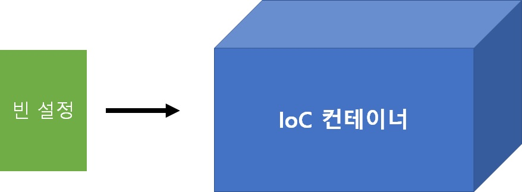

# 백기선님의 스프링 핵심기술 인프런 강의 정리

## IoC 컨테이너 1부 : 스프링 IoC 컨테이너와 빈

* 스프링이란?

    소규모 애플리케이션 또는 기업용 **애플리케이션을 자바로 개발하는 데** 있어 유용하고 **편리한 기능을 제공하는 프레임워크**

* IoC란?

    Inversion of Control, 의존 관계 주입(Dependency Injection)이라고도 한다.

    의존 객체를 직접 생성하지 않고 주입받아 사용한다.

    생성자 주입의 경우 스프링이 없어도 개발자가 직접 주입할 수 있다.

> DI의 종류
> * Constructor Injection
> * Setter Injection
> * Interface-based Injection
> * Service Locator Injection

* BeanFactory

    IoC의 가장 핵심 클래스

* Bean

    Spring IoC 컨테이너가 관리하는 객체

  * 해당 객체가 Bean인지 아닌지 어떻게 알 수 있는가?

    IoC 컨테이너에 등록되었는가 아닌가에 따라 달라진다

  * 컨테이너로부터 의존성 주입을 받으려면 Bean이어야 한다

* Spring IoC 컨테이너에 등록된 Bean들은 기본적으로 Singleton Scope를 가지는 Bean으로 등록된다

* Scope  
  * Singleton : 하나만 생성되어 재사용한다
  * ProtoType : 매번 새로운 객체를 생성한다
  * Singleton의 이점
    * 하나만으로 재사용하기 때문에 메모리 절약
    * 이미 컨테이너에서 만들어진 객체이기 때문에 Runtime시 성능 최적화에 유리함

* 라이프 사이클 인터페이스
  * Spring IoC 컨테이너에 등록된 Bean에만 해당된다
  * Bean이 생성, 소멸될 때 다른 처리를 할 수 있다

* ApplicationContext
  * BeanFactory를 상속받는다
  * BeanFactory에 비해 다양한 기능을 가지고 있다

## IoC 컨테이너 2부 : Application Context 와 다양한 빈 설정

* SpringBoot의 장점

  dependency 관리

* Spring IoC 컨테이너는 **빈 설정 파일**이 있어야 한다



* Application.xml에 하나씩 빈을 등록하는 것은 고전적인 방식
* 빈의 스코프
  * protoType : 매번 새로운 객체를 생성
  * request : 요청당 새로운 객체를 생성
  * session : 세션당 새로운 객체를 생성
  * singleton : 하나의 객체로 재사용함

* xml 파일에서 일일이 빈을 등록하는 게 번거로워서 등장한 것이 " "component-scan"이다

* @Component 애노테이션이 붙은 클래스는 빈으로 등록된다
* @Component를 확장한 애노테이션 4가지
  * Controller
  * Repository
  * Service
  * Indexed

* 의존성 주입을 받을 때 사용되는 애노테이션
  * Autowired
  * Inject : 또 다른 의존성 주입이 필요함
  * Resource

위의 각 애노테이션의 차이점은 다음에서 확인
[링크1](https://www.linkedin.com/pulse/difference-between-inject-vs-autowire-resource-pankaj-kumar), [링크2](https://www.sourceallies.com/2011/08/spring-injection-with-resource-and-autowired/#more-2350)

* Java 파일을 이용한 빈 설정
  * @Configuration을 클래스에 붙여줘야 한다
  * @Configutation은 해당 클래스가 설정파일임을 알려준다

* Setter 주입 VS Constructor 주입
  * Setter 주입을 받게 되면 주입 받는 클래스 내부에서 애노테이션을 통한 주입을 받을 수 있다, 그러나 생성자 주입을 받는 객체는 생성자에서 넘어온 객체를 통해서만 주입받을 수 있다

* @SpringBootApplication 애노테이션은 ApplicationContext를 대신 생성해준다

## IoC 컨테이너 3부 : `@Autowired`

* 클래스의 역할별(`@Service`, `@Controller`, `@Repository`) 애노테이션을 붙이는 이유는?

  AOP를 이용하여 애노테이션별로 기능을 부여할 수 있기 때문이다

* 생성자, 세터, 필드에 `@Autowired`를 붙이면 객체 생성할 때 해당 애노테이션이 붙은 곳으로 의존 주입을 시도한다
* 만약 자동으로 주입받지 않으려면 `@Autowired`(required = false)로 설정하면 된다. 기본값은 true
* 생성자 주입의 경우 의존 주입받을 클래스가 빈으로 등록되어있지 않으면 객체가 생성되지 않는다. 그러나 세터나 필드의 경우 `@Autowired`(required = false)를 설정하면 일단 객체는 생성된다. 그러나 세터나 필드에 주입을 시도한다면 주입되지 않는다.
* 왜 빈으로 등록되지 않으면 주입을 할 수 없는건가?

동일한 타입의 빈이 여러 개라면?

* 에러 발생함
* 해결방법 3가지
  * 여러 동일 빈 중 우선 사용할 빈에 `@Primary` 애노테이션을 붙인다
  * 주입받는 곳에 `@Qualifier`("빈 이름")을 붙여준다. 이 때 빈의 이름은 소문자로 시작해야 한다
  * 해당 타입의 모든 빈을 주입받을 수 있다

```java
@Autowired
<List> xxxxRepository;
```

List로 받으면 된다, List말고 다른 컬렉션으로도 가능할까?

`@Autowired`는 타입만으로 주입받는 것이 아니라 이름으로도 빈을 찾는다, 다만 이름의 경우 빈의 이름과 주입받는 field의 이름이 동일해야 한다. 추천하는 방법은 아니다

## IoC 컨테이너 4부 : `@Component`와 컴포넌트 스캔

* basePackage
  * basePackage : 문자열로 지정해야 한다, type-safe 하지 않음
  * basePackageClasses : 문자열로 전달된 클래스를 기준으로 스캔한다.

* 빈 주입이 제대로 이뤄지지 않는다면 컴포넌트 스캔 범위를 잘 체크하자, 다른 패키지일 경우 스캔범위에 따라서 스캔되지 않을 수 있다
* 컴포넌트 스캔에 **필터**를 걸면 필요없는 것들을 걸러낼 수 있다

컴포넌트 스캔의 2가지 특징

* 스캔범위
* 필터

**내가 직접 빈을 등록해야 하는 상황일 때**, functional 하게 빈을 등록해줄 수도 있다 (구동시간 단축 효과), 다만 모든 빈을 functional 하게 등록하면 다시 컴포넌트 스캔이 등장하게 된 계기와 동일해지므로 남발해선 안 된다.
> 내가 직접 빈을 등록해야 하는 상황은 언제일까?

